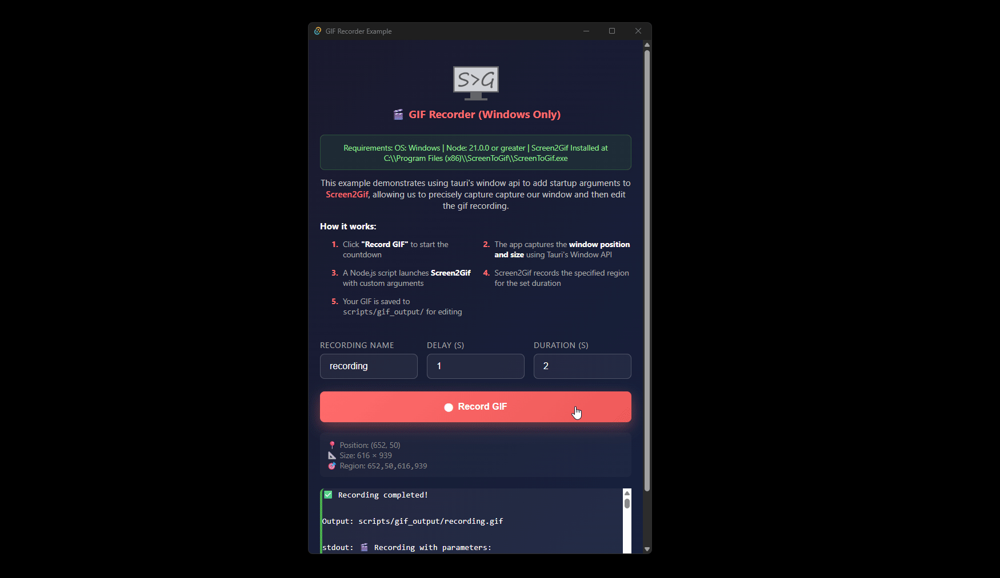
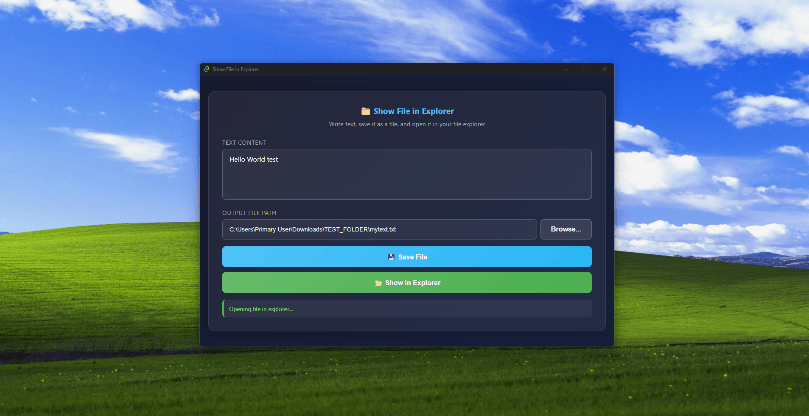

# Tauri Examples

A collection of example applications built with Tauri, demonstrating various features and integrations.

## 📁 Examples

### 🎬 GIF Recorder Example

A Windows-only application that demonstrates using Tauri's Window API to integrate with Screen2Gif for precise screen recording.

### 📂 Show File in OS Explorer

A minimal cross-platform application demonstrating how to:
- Write text content and save it as a `.txt` file
- Use Tauri's dialog plugin to select output file paths
- Use Tauri's fs plugin to write files
- Open the saved file in the OS file explorer using the [`showfile`](https://docs.rs/showfile/latest/showfile/) crate

## License

This project is open source and available under the [MIT License](LICENSE).
